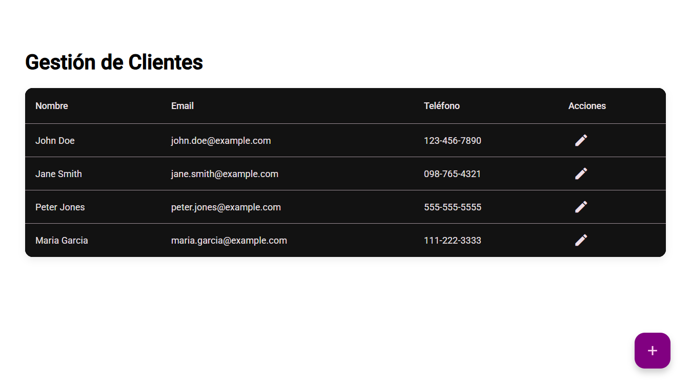
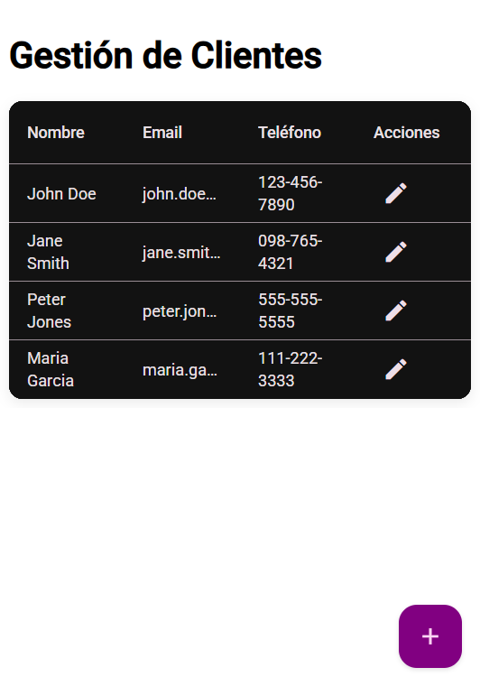
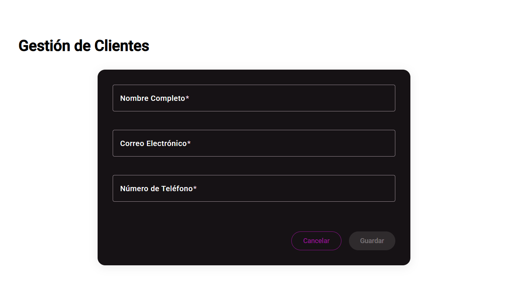
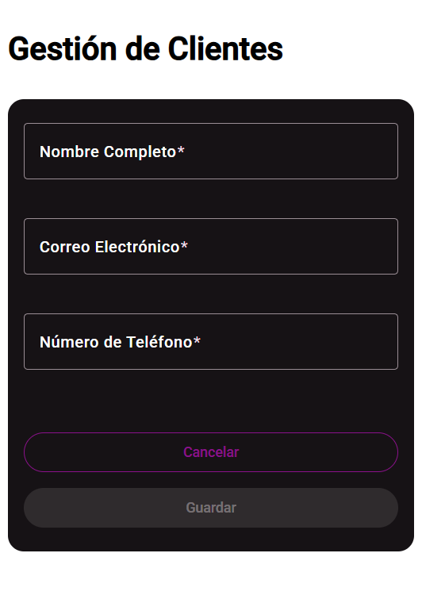
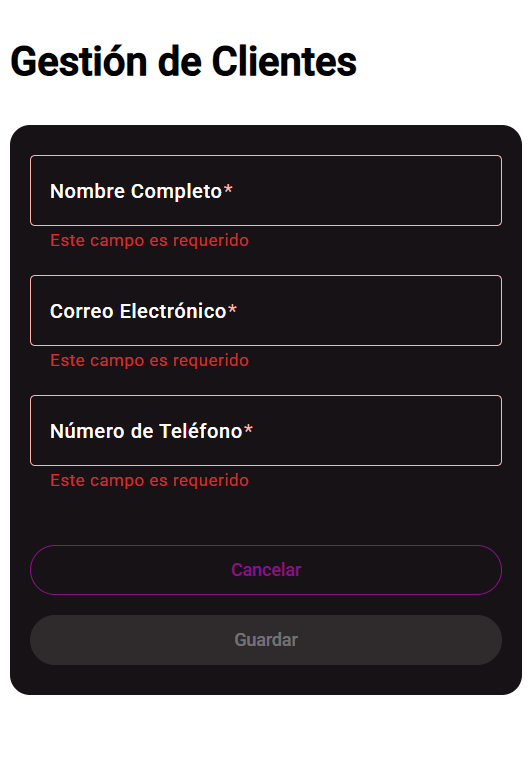
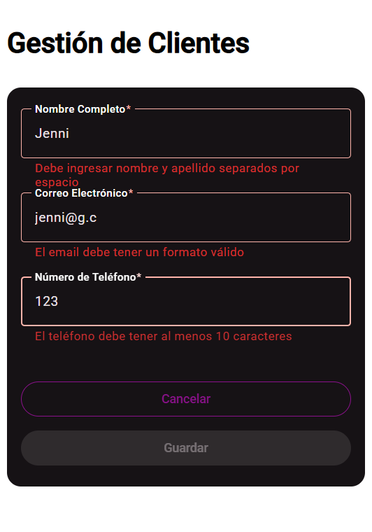
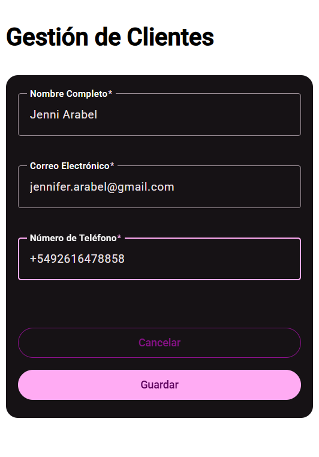
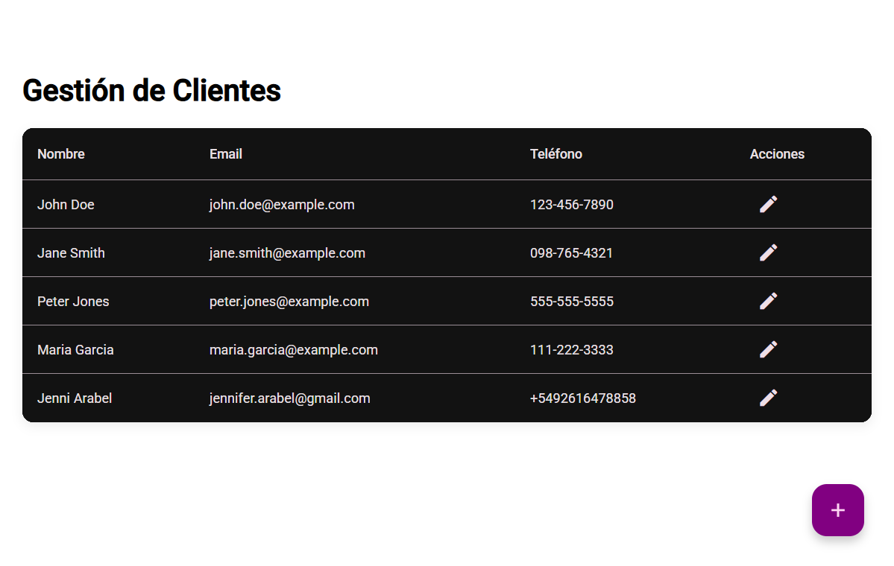
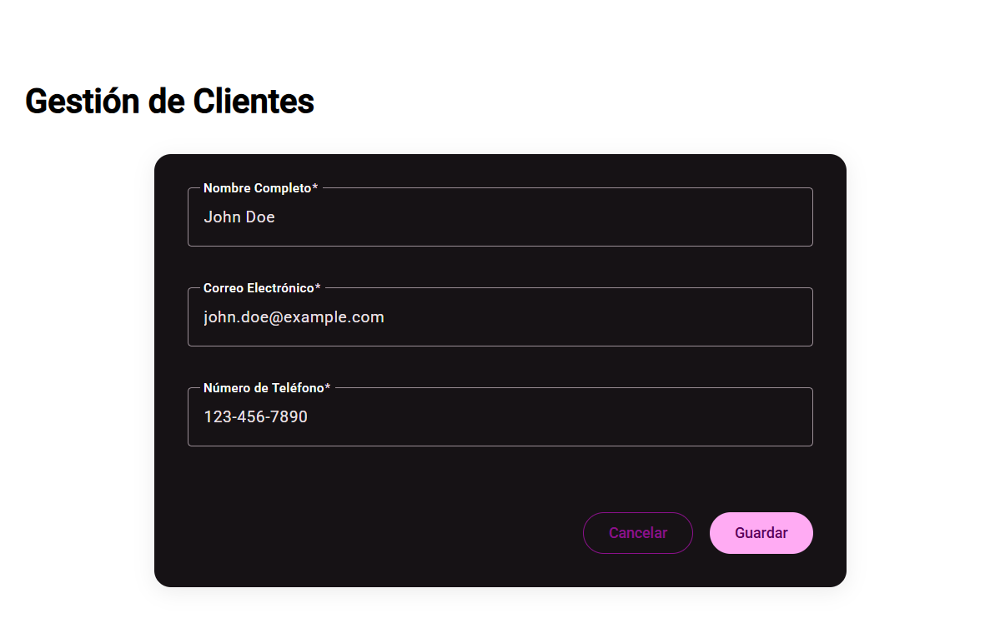

# 🧪 Prueba Técnica – Frontend Developer Jr (Angular + Microfrontends)

## 📋 Descripción General

Este repositorio contiene la solución desarrollada por **Jennifer Arabel** para la **Prueba Técnica – Frontend Developer Jr (Angular + Microfrontends)**.  
El proyecto implementa un **microfrontend funcional** llamado `customers-mfe`, encargado del módulo **Gestión de Clientes**, desarrollado con **Angular 17**, **Module Federation** y **Angular Material**.

---

## 🧠 Objetivo del Proyecto

Desarrollar un microfrontend independiente que permita **listar, crear y editar clientes** (nombre, email, teléfono) aplicando:
- Buenas prácticas de desarrollo frontend.
- Arquitectura modular y escalable.
- Principios **SOLID** y **Clean Code**.
- Programación reactiva con **RxJS** y **Angular Signals**.
- Diseño limpio y responsivo con **Angular Material**.

---

## 💻 Stack Técnico

- **Angular 17**
- **Angular Material**
- **Module Federation (Microfrontends)**
- **RxJS y Signals**
- **TypeScript estricto**
- **Git / GitHub**

---

## ⚙️ Instalación y Ejecución

# 1. Clona el repositorio
git clone https://github.com/JenniArabel/Prueba-tecnica.git
cd Prueba-tecnica/demo-mf

# 2. Instala dependencias
npm install

# 3. Levanta el microfrontend
ng serve customers-mfe

## Capturas

